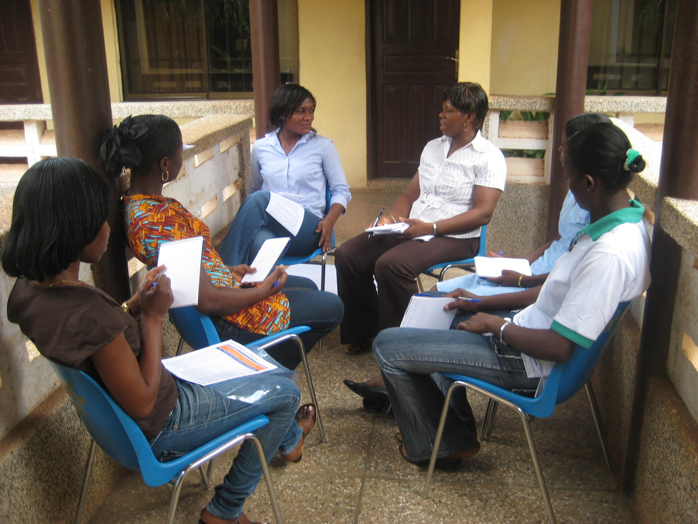
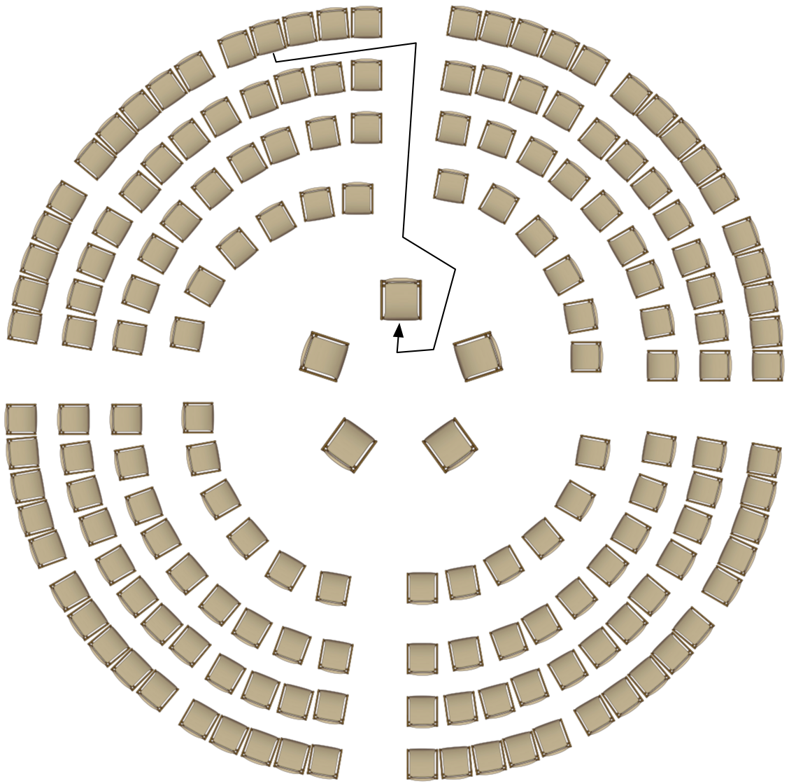
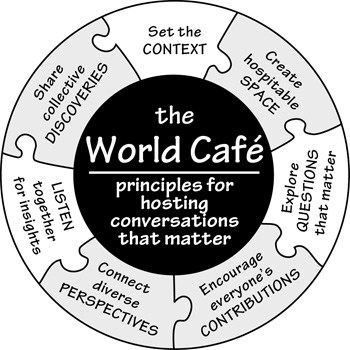
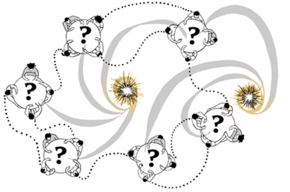
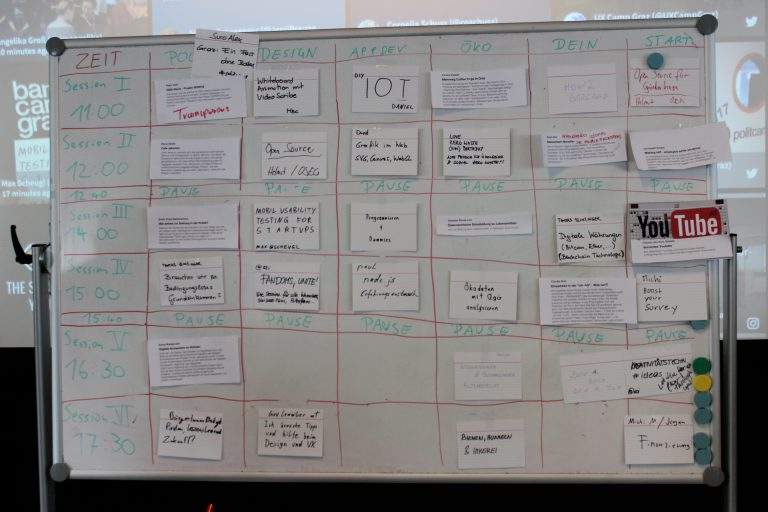
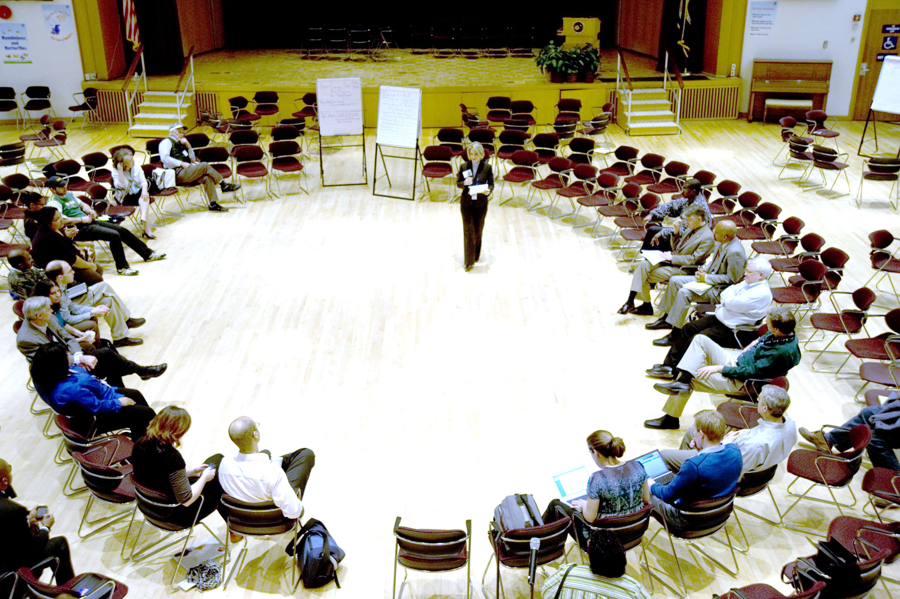

% Group Techniques
% Kevin Singer (1028092)
% 19.11.2017

<!--
~2 pages
750-1kw (w/o references)
review 3 others

Template  

Each report should contain the following sections: 

1.  Introduction: What is the core idea?  Explain the origins of the method, who proposed it? Are there different flavours or variants? In which paradigm does this method operate? What are the most relevant theories?  
2.  Use: Explain when to use it and how. What data does it produce?  
3.  Advantages and Disadvantages: Explain what the biggest advantages and disadvantages of this method are 
4.  Example: Provide a short example from the literature 

Note: You can deviate from this structure as long as all relevant points are discussed.

 unrelated: emejulu & mcgregor toward a radical digital citizenship

[image]: image.png "Image Title" 
![Alt text][image] 
A reference to the [image](#image).

See figure \ref{mylabel}.

[^ref1]: See @Author1, p. 20
- - filter pandoc-citeproc

This is [an example][id] reference-style link.
This is [an example](http://example.com/ "Title") inline link.
[id]: http://example.com/  "Optional Title Here"
this is a [link to ref][reftest] 
[reftest]: http://example.org is a reftest

see asdf[^foo] or jkl^[asdfasfd]
[^foo]: bar

ich schreibs auch für meine peers :P
 also hab beschlossen der sinn davon ist
 leuten ein gefühl dafür zu geben wann sie mehr papers lesen sollten
 aka wann die methode hilfreich ist, was es für skills braucht, whatever
 mit einem sehr deutlichen "seids keine doofen zahlenfetischisten" unterton
 kontext der entstehung ist bei mir auch sehr wichtig, das ist bei "group methods" vielleicht bissi schwierig :P

-->

<!--
Group Techniques in general:

{TODO} did they influence each other and if so how?

-->

<!--
-->

Disclaimer: I've been being sick for the last two days (and still am) and pretty overworked before that with other courses, wage-labor and critical tasks in side-projects, which is also the reason why I'd broken down and become sick in the first place. As such this report has been written while exhausted and over the span of a few hours and suffered accordingly in quality. :|  The largest parts of this report will be from my personal experience in participating in these formats  with only a few references (of suboptimal quality) as I haven't had the time to
do proper literature research for the six <!-- TODO!!! correct if less --> methods described below. This isn't intended as an excuse, but as a fair word of warning (don't trust this report as a source too much) and as a bit of contextual information so as to not leave you wondering "what the hell was up with this author?!" ^^

Also, I didn't manage to convert all notes into full prose. To see the notes you can go here: <https://raw.githubusercontent.com/m0ru/urm-methods-report/master/group_techniques_-_methods_report.md>

With that out of the way and without further ado: Group Techniques.  
As this is more a category of loosely connected methods formulated for very different reaons in different situations, I'll go over the ones mentioned in the lecture slides one by one and try to compare them in the process. The methods are as follows:

* Focus Groups 
* Fishbowl 
* Bar Camp 
* World Cafe 
* Breakout Sessions 
* Open Space (Technology)

# Focus Groups 

[{ height=200px }](https://commons.wikimedia.org/wiki/File:Focus_Groups,_National_Network_Meetings,_GINKS_IMG_3920_\(5348319263\).jpg)

The idea is to recruit a small group (e.g. 6-12) of people from the target demographic/roles, usually in a lab setting, give them a question and let them discuss it with only minimal moderating. Alternatively researchers can give them an exercise to follow, e.g. role-playing, drawing, or ranking, sorting, grouping and/or collaging items, text snippets and pictures. Usually the sessions are audio/video-recorded (which suggests the lab setting) and notes are taken by the moderator or a seperate
observer. All of this resulting data can later be analyzed and (as most group methods) will inform about memories  of experiences (colored by the recall process however), mental models, lingo, and in particular and contrast to single-person interviews: about social dynamics in the group. 

Note, that some of the former only come up due to the presence of multiple people which remind each other about things they wouldn't have thought of in a single-person interview; that are collective memory. The social (power) dynamic between
participants and the effect of an intimidating lab setting (presence of recording equip and authoritative researcher) might also mean that some statements are self-censored and/or some participants might not get to speak much. 

<!-- TODO move to general section -->
Due to the setup it's also not suited to directly study dynamics in larger groups on it's own (the other group methods, e.g. barcamps and world-cafes are better suited for those sizes). It's also inherently qualitative and best suited for studies in the constructivist (and potentiall critical theory) paradigma(s) as most of the group methods -- though some lean more towards generating action plans that I'd argue to be in the realms of critical theory (and action theory)).

Note, that with some reduction in quality, these can also be held online using video-chat and online collaboration tools (for exercises)

<!-- TODO
move to general section

General Challenges (from slides):

* Logistics - more people, more constraints 
* Managing Space 
* Moderation
-->

The method, then named "Group Studies" was discovered/invented in 1946 by Robert Merton who was studying the effects of propaganda (in particular radio broadcasts, army training and morale films) at the US Bureau of Applied Social Research at the Columbia University. It was later picked up and further developed by the Viennese psychologist and marketer Ernest Dichter who was heavily influenced and had studied under Sigmund Freud, who before his death also gave it the name "Focus
Groups". Dichter's goal was to study the subconscious cravings influencing buying decisions by reading between the lines of what people talked about in the focus groups. Campaigns he worked on included for example the Chrysler Plymouth convertible (with the result to market it as "home product" to wifes so they wouldn't stop their husbands from buying a cabriolet) and the Barbie Doll (that should give girls a future self to associate with, with the very Freudian twist that
it's all about sex and sex appeal). The method fell out of favor with the rise of computer based analysis and decline of Freudianism, but later rediscovered and is widely used in qualitative market research. (Source: <http://blog.qsample.com/freud-and-the-intriguing-origins-of-the-focus-group/>)

# Fishbowl 

[{  height=250px }](https://commons.wikimedia.org/wiki/File:Fishbowl_diagram_172.png)

The fishbowl is a discussion structure for larger groups (see seating-arrangment figure above), where a few highly visible and constantly rotating discuss in an inner circle of (e.g. 2-6) chairs. Everybody who's not actively discussin sits in the outer circle(s).
Usually an expert starts in the center to kick off the discussion on a given topic. People can switch to a free chair in the inner circle when they want to say something. Once they've made their point and replied to any follow-up questions or -discussion-strands they then move back to the outer circle (the same goes for the initial expert). This allows people to sit back and observe when they don't want to talk at the moment. 
It also has the effect that people have time to think about points they want to make before and while moving into the inner circle. 

For smaller groups the technique isn't necessary. Much larger groups should probably split into seperate fish-bowl and report any results afterwards.

It suffers from similar issues about dominant discutants as focus groups with the intensification that the crowd to speak in front of is bigger and there's a relatively space in the outer circle where one doesn't have to talk, thus some person's views will not be reflected in the discussion. To lessen this effect and to ensure people vacate theirs seats at the right time an active moderator will be required. Compared to focus groups, however, it also profits from similar positive effects, e.g. collective memory and has the potential to combine / reflect even more views due to the group size.

In terms of outcomes, collective documents and plans of action can be aggreed upon. Additionally anyone might make notes and researchers might record the discussion.

For an example think about the fishbowl we had on 'self driving cars' in class.

<!-- TODO move to general section
### In which paradigm does this method operate? 
constructivist if used similar to a focus group to elaborate on personal experiences and discuss mental models but can also be critical theory in the sense that an action plan is formulated (even though world cafe/breakaway/barcamp/openspace+reporting probably deals better as finer points/sub-topics can be better discussed and more people have a chance to contribute due to the smaller effective group sizes / less anxiety about speaking in front of larger groups)

* Logistics - more people, more constraints 
* Managing Space 
* Moderation
-->

# World Cafe 

[{ height=200px }](http://rhizome.coop/facilitating-meetings-middle-game/) 
[{ height=200px }](https://bcpslis.pbworks.com/w/page/107744660/World%20Cafe%20Model)

The goal is to discuss complicated issues (and come with up with an action plan) by synthesing as many people's viewpoints as possible. The setup has multiple tables spread around a room, e.g. one per sub-topic or general approach. The tables are covered in paper so people can write on them. The session starts off with an optional talk that introduces the topic (if necessary). People then discuss on their table and draw/write on the paper. After a while everyone but one person
per table switches to a different table. The person who's stayed introduces that tables discussion progress to the new group. Thus people can inspire each other, there's a certain continuity to each table's discussion, everyone get's involved and has room to speak, but the discussion groups stay small and well suited to casual, involved and stress-free discussion. Optionally at the end, each tables "host" reports it's discussion's results back to the plenum.

This method works for groups of medium (15+) to very large sizes (up to several hundred persons). 

The host's reports (potentially recorded), any collectively agreed outcome/action and the drawing and writing on the tables can later be used for analysis. However the former one's as well as the intrinsic personal gains from the discssions for people participating in the process are an end by and in themselves in my opinion.

Note that a very important part of hosting a world cafe is making sure the ambience is inviting, relaxing and casual to make people as comfortable as they'd be in an actual cafe (hence the name)

Historically the method resulted from a 1995 meeting of business persons and academics at the home of Juanita Brown and David Isaacs in California. Their plan for large-circle meeting was disrupted by rain and they split up to tables that accidentally had makeshift tablecloths they could write/draw on. Thus the method was discovered/invented.

**References:**

* <http://www.theworldcafe.com/key-concepts-resources/world-cafe-method/>
* <http://www.worldcafe.eu/en/index.html>
* "World Cafe Guidelines & Principles" on youtube by OurEllipses (2009/08):<https://www.youtube.com/watch?v=YrTKD8NpApY>

# Breakout Sessions 

I didn't get around to research these to much, but from what I gather the idea is to brake up the agenda of full-frontal conferences a bit, by splitting the audience into smaller groups that each interactively, discuss on a specialised topic and then report back to the larger plneum. The smaller groups better facilitate discussion, provide a less threatening setting to speak up and allow specialising on a sub-topic that'd be too specific for the larger group. As far as I
understand the outcomes can be recorded in notes or posters and later be analyzed.

# Bar Camp 

[{ height=200px }](http://barcamp-graz.at/2017/04/so-schaut-der-sessionplan-vom-ersten-barcamp-tag-aus/)

Barcamps are so-called "unconference", i.e. they're a critique and subversion of frontal-presentation-, pre-planned-agenda-conferences by allowing people to come up with their own (usually very interactive) sessions every morning^[barcamp graz 2017 - video of (sparsely attended) planning session on sunday: <https://www.youtube.com/watch?v=IF4y63whodg>] of the conference. The name is a nudge towards the invite-only [Foo-Camp](https://en.wikipedia.org/wiki/Foo_Camp) first organised by the hacker Tim O'Reilly to utilize vacant office space he had access to. Bar-Camps take their methodology from
Foo-Camps but are accessible to the public.

The first session in the morning is people writing down sessions they want to run. These slips of paper are then put on a room- and time-slot on a session-planning board (see photo). If there's enough rooms, they can also be assigned specialised topics (as in the case of the photo of the BarCamp Graz 2017^[blog on barcamp graz 2017: <http://barcamp-graz.at/blog/>] session plan above).

There's also the possibility to combine this barcamp-mode with a regular by e.g. having a fixed track / fixed slots by pre-arranged speakers in paralell or interspersed with barcamp session (as is the case for the Viennese UxCamps)

Barcamps have a strong contribution, e.g. the rules for the BarCamp Graz contain among others: "if this is your first barcamp, you have to hold a session."

Sessions can be basically anything that people will show up. E.g. at the aforementioned BarCamp we there was a ground training and a board-games session, as well as several practical workshops, many discussion groups and a few presentations. 

As it's an (un)conference format, it's only suited for larger numbers of people and requires extensive logistics around rooms, catering, evening events, registration, etc.

The main take-away usually is in the form of contacts, personal knowledge gained as well as results of any sessions that can be anything from notes, recordings, posters up to technical prototypes.

# Open Space (Technology)

[{ height=200px }](https://en.wikipedia.org/wiki/File:NASA_Open_Space_2_Innovate.jpg)

Open Spaces are a very detailed method to organize discussions in larger groups (usually towards an action plan). Chairs are arranged in a large circle (the plenum/"Opening Circle"). Mainly during the first 30-90 minutes people (called "birds") can suggest sub-issues/-topics (that are then posted to a bulletin board in the center) and that are then discussed in their local area of the larger circle or a breakaway circle (their "nests"). They're responsible for kicking off the local discussion, taking notes and reporting back to the
plenum/"Closing Circle". Other can move around freely (and are called "bees" if they stick somewhere or "butterflies" if they move around constantly), thus transporting ideas between the sub-groups. The entire process is managed by a moderator called a "facilitator" that should be "present but invisible", i.e. intervene as little as possible.

The resulting notes are then compiled as proceedings and send to all participants.

Guiding principles:

* Whoever comes is the right people 
* Whenever it starts is the right time 
* Wherever it is, is the right place 
* Whatever happens is the only thing that could have, be prepared to be surprised! 
* When it's over, it's over (within this session) 

Owen's Law of two feet: "If at any time during our time together you find yourself in any situation where you are neither learning nor contributing, use your two feet, go someplace else."

Owen^[Owen, Harrison (2008). Open Space Technology: A User's Guide (3rd ed.). Berrett-Koehler. ISBN 978-1-57675-476-4.] claims that it works well for issues that require/have high complexity, diversity, conflict (real or potential) and urgency (but badly otherwise) 

The method was initially invented/discovered by Harrison Owen to deal with the overhead of organizing a conference on "managmental/organisational restructional" with the idea to let people organize their own conference. 

**References:**

* <https://en.wikipedia.org/wiki/Open_Space_Technology>
* <http://www.chriscorrigan.com/openspace/whatisos.html>

